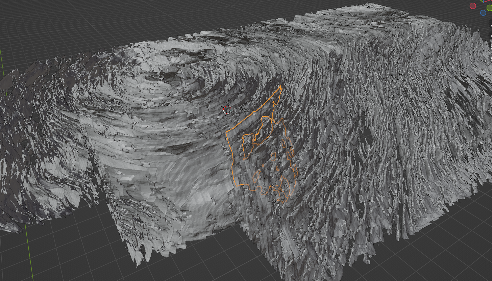
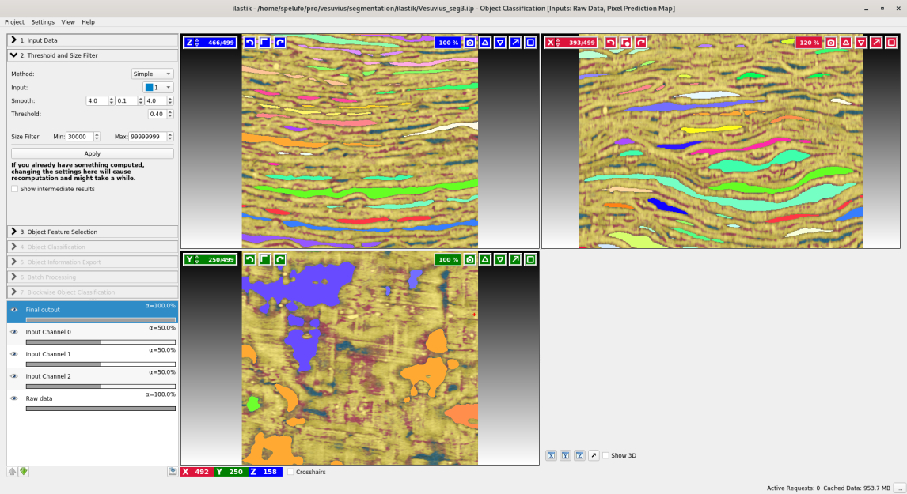

# Automatic segmentation attempt using ilastik

The `top_pipeline.jl` file in this repo implements an attempt at automatic
segmentation using [ilastik](https://ilastik.org).


## Running the script

If all you want to do is run the script that does all the steps necessary for
segmentation you can run the `top_pipeline` function on one grid cell at a time
as shown in this section. The pipeline uses the two ilastik projects (.ilp) in
the ilastik directory. If you'd rather create your own ilastik projects to
adjust the parameters or try something else move on to the next section.

```
# Install julia.

# Clone this repo.
$ git clone https://github.com/spelufo/vesuvius-build.git

# The data directory that mirrors the folder structure on the server must be a
# sibling to vesuvius-build, so we set that up before `cd vesuvius-build`.

# If you have downloaded the data from the server somewhere else you can symlink to it.
$ ln -s path/to/data

# Otherwise create the directory for the cells.
$ mkdir -p data/full-scrolls/Scroll1.volpkg/volume_grids/20230205180739

# Download cells from the server, e.g.: cell_yxz_006_008_004.tif

$ cd vesuvius-build

# Create the target directory, where results will go.
$ mkdir ../data/segmentation

$ julia

julia>include("top_pipeline.jl")

# This will probably fail the first time you run it because you don't have some
# julia packages installed. Do as the error says to install the required libraries,
# and try the include command again until it doesn't output an error.

# Run the top_pipeline function passing the coordinates of the cell.
# It will take a long time, and output some diagnostic information as it runs.
julia>top_pipeline(6, 8, 4)

```

The `top_pipeline` function outputs results to `../data/segmentation`, creating
a new folder for each cell. After running you should see something like:

```
$ find ../data/segmentation/cell_yxz_006_008_004/
../data/segmentation/cell_yxz_006_008_004/
../data/segmentation/cell_yxz_006_008_004/cell_yxz_006_008_004.h5
../data/segmentation/cell_yxz_006_008_004/cell_yxz_006_008_004_hole_ids.h5
../data/segmentation/cell_yxz_006_008_004/cell_yxz_006_008_004_probabilities.h5
../data/segmentation/cell_yxz_006_008_004/holes
../data/segmentation/cell_yxz_006_008_004/holes/cell_yxz_006_008_004_hole_1.stl
../data/segmentation/cell_yxz_006_008_004/holes/cell_yxz_006_008_004_hole_10.stl
../data/segmentation/cell_yxz_006_008_004/holes/cell_yxz_006_008_004_hole_11.stl
../data/segmentation/cell_yxz_006_008_004/holes/cell_yxz_006_008_004_hole_12.stl
...
```

The stl files are the meshes of the holes between papyrus sheets in the scan.

They can be imported into blender at a scale of 0.01 with the z axis up to make
them line up with the scan in a blend file that uses [vesuvius-blender](https://github.com/spelufo/vesuvius-blender#add-a-scan).


## Example results

I run `top_pipeline` on 24 cells around the center of the scroll on grid layer 23.
It took several hours. Here is a screenshot of the [results](https://drive.google.com/drive/folders/1d_J64HAm8vrkkkAhYKI-Ce8iJVgIwKhK?usp=sharing):



The results depend a lot on the ilastik parameters, and after doing this process
I realize that I tuned them for a cell with a specific sheet orientation that
will not have been the same for all most cells in layer 23, so there is room
for improvement.


## The method

The idea is to segment the negative space between the sheets, which I call holes.
There are several things motivating this:

* Leveraging the three-dimentionality of the data.
* The boundary of the holes are the front and back surfaces of two sheets. These
  surfaces are precisely the ones that should be easiest to delimit in an automated
  way.
* The fact that holes are mostly separated from each other, while sheets all touch.
* Ilastik can do it.

The main problem with it is that where sheets touch there are "holes in the
holes". To make a complete solution from this we would have to extrapolate from
the meshes to fill the holes in the sheets.

The steps are as follows:

1. Convert the TIFF file (`*.tif`) file to HDF5 (`*.h5`) in the format that ilastik needs.
   From julia: `include("cell_tif_to_h5.jl")`, and then call `cell_to_h5(inputfile, outputfile)`.
   E.g. `cell_to_h5("../data/full-scrolls/Scroll1.volpkg/volume_grids/20230205180739/cell_yxz_006_008_004.tif", "../data/segmentation/cell_yxz_006_008_004/cell_yxz_006_008_004.h5")`.

2. Run [ilastic pixel classification](https://www.ilastik.org/documentation/pixelclassification/pixelclassification)
   to separate papyrus from background. Use `cell_yxz_006_008_004.h5` as input.
   Select all the features for classification.
   Call the blue class (1) "bg" for background and the yellow class (2) "scroll".

3. Run [ilastic object segmentation](https://www.ilastik.org/documentation/objects/objects)
   on the result of pixel classification. Use `cell_yxz_006_008_004.h5` and the
   output probabilities from the previous step as inputs. Use the following parameters
   as a starting point. You may want to adjust "smooth" and "threshold". A non-isotropic smoothness
   like in the example may produce better results for a given scroll sheet orientation, but if
   this project's parameters are latter used on other cells it might produce suboptimal results
   (I made this mistake with the example results above).
   
   This ilastik workflow also does object classification, but we only care about
   the part that does segmentation and generates "object identities". Select any
   features to proceed to the export step and change the export settings to
   output object identities.

4. Run the marching cubes algorithm to turn each hole object id bitmap into a
   mesh of the boundaries of the hole. The boundaries of holes are also the
   boundaries of sheets.
   From julia: `include("ilastik_objids_to_meshes.jl`) and then call `hole_ids_to_meshes(hole_ids_file, file_prefix, jy, jx: jz)`.
   For example: `hole_ids_to_meshes("../data/segmentation/cell_yxz_006_008_004/cell_yxz_006_008_004-data_Object Identities.h5", "../data/segmentation/cell_yxz_006_008_004/holes/cell_yxz_006_008_004_hole_", 6, 8, 4)`


